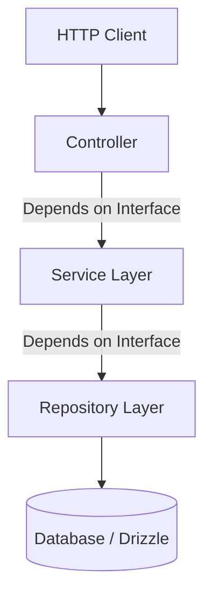

# Backend Module Architecture & Folder Structure

This guide documents the enterprise-grade architectural patterns developers must follow when creating new backend modules within this workspace.

Every backend module or domain capability (e.g. `auth`, `users`, `audit-log`) must be organized into four clear layers to ensure clean separation of concerns, testability, and loose coupling.

---

## Folder Structure

A standard backend module must reside within its domain directory (e.g., `packages/core/src/lib/domain/<module-name>`) and conform to the following directory structure:

```text
<module-name>/
├── dtos/
│   ├── create-<module>.dto.ts
│   ├── update-<module>.dto.ts
│   └── <module>-response.dto.ts
├── controller/
│   └── <module>.controller.ts
├── services/
│   ├── <module>.interface.ts
│   └── <module>.service.ts
├── repositories/
│   ├── <module>.interface.ts
│   └── <module>.repository.ts
└── index.ts
```

---

## Architectural Layers

### 1. DTOs (Data Transfer Objects)
Located in: `./dtos/`

- **Purpose**: Defines and validates the schema of incoming request payloads or outgoing response structures.
- **Rule**: Never pass raw database models or request objects directly to the business layer. Use DTOs to sanitize, transform, and validate input fields.
- **Libraries**: Use classes/interfaces paired with validation libraries (e.g., `zod` or `class-validator`) to assert schema validity at the entry boundary.

### 2. Controllers
Located in: `./controller/`

- **Purpose**: Exposes the API endpoint, handles routing, HTTP status codes, and HTTP-specific logic.
- **Rule**: Controllers must be kept extremely thin. Their sole responsibility is to extract parameter payloads, invoke the appropriate service, and return HTTP responses. Do NOT write business logic or database queries here.
- **Dependencies**: Depends strictly on **Service Interfaces**, not concrete service implementations.

### 3. Services
Located in: `./services/`

- **Purpose**: Encapsulates the core business logic, rules, workflow orchestrations, and transactions.
- **Rule**: Services are agnostic to how they are called (HTTP controller, CLI command, cron job, or event listener). They receive plain data objects/DTOs and return results.
- **Interfaces**: Define a clear service interface (e.g. `IAuthService`) to support mocking in tests.
- **Dependencies**: Depends on **Repository Interfaces** for database access, and other service interfaces for cross-module features.

### 4. Repositories
Located in: `./repositories/`

- **Purpose**: Encapsulates data access and storage queries (SQL, Drizzle query helper, external APIs).
- **Rule**: All database operations (CRUD, complex joins, seed data queries) must reside here. No SQL or ORM calls should leak into the service layer.
- **Interfaces**: Define a repository interface (e.g. `IUserRepository`) to easily swap database implementations (e.g. Postgres to MongoDB or memory mock for testing).

---

## Dependency Flow Diagram

To keep modules loosely coupled, follow this strict downward dependency flow:



> [!IMPORTANT]
> **Always program to interfaces, not concrete implementations.** This allows us to unit test the service layer in isolation using mock implementations without connecting to a live database.
